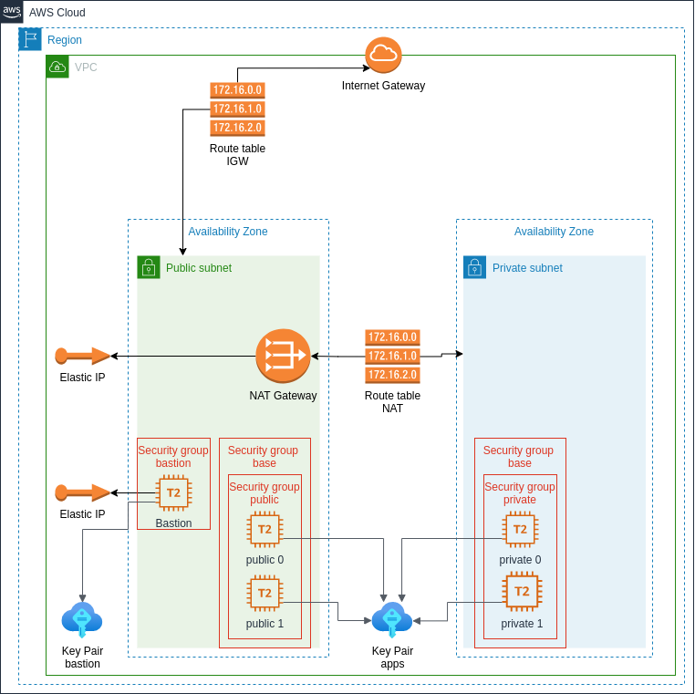

### Implementing the scenario: https://docs.aws.amazon.com/vpc/latest/userguide/VPC_Scenario2.html
### Route table config: https://docs.aws.amazon.com/vpc/latest/userguide/vpc-nat-gateway.html#nat-gateway-scenarios

Drawio(aws4 lib) diagram representation:



https://www.draw.io/?splash=0&libs=aws4
<br/><br/><br/>

Implementing bastion host for monitoring(dummy key pairs generated with at `/keypairs/generate-keypairs.sh` script.
Instructions to access bastion host and instances:

- 1. Configure ssh keys agent forwarding, to allow access to private instances without storing private keys in bastion host

    eval `ssh-agent -s`                                                 # start agent
    ssh-add bastion_id_rsa                                              # add bastion key to agent(requires passphrase)
    ssh-add apps_id_rsa                                                 # add apps key to agent(requires passphrase)
    ssh-add -L                                                          # check added keys
    kill $SSH_AGENT_PID                                                 # (after use) closes agent

- 2. Connect to instances with ssh

  - 2.1 `ssh -A ec2-user@<instance_public_ip / instance_public_dns>`    # [from local host] Connect to bastion

  - 2.2  `ssh ec2-user@<instance_private_ip / instance_private_dns>`    # [from bastion host] Connect to private instance with ssh with previously enabled ssh agent forwarding:

  - 2.3  `ssh -A -J ec2-user@<instance_public_ip / instance_public_dns> ec2-user@<instance_private_ip / instance_private_dns>`     # [from local host] Directly connect to private instance using jump flag

References for bastion host:
```
https://aws.amazon.com/pt/premiumsupport/knowledge-center/ec2-troubleshoot-bastion-host-connection/
https://crishantha.medium.com/handing-bastion-hosts-on-aws-via-ssh-agent-forwarding-f1d2d4e8622a
https://medium.com/codex/how-to-setup-bastion-server-with-aws-ec2-b1590d2ff8
```