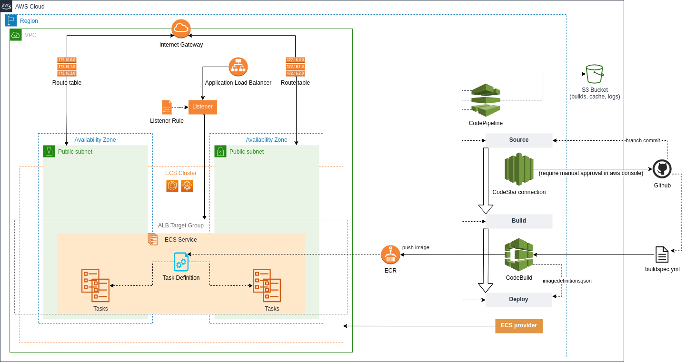

# Example of a monorepo approach

### Complete with multiple modules and resources stacks:

---
## Implemented applications
- ECS Application
- Build & Pipeline

   

---
### ECS Application + Build & Pipeline

Drawio(aws4 lib) diagram representation:

   

---
# TODO: 

## example documentation readme(this file)
## terragrunt dependencies(also maybe variable backend config)

### load balancer auth subrequest
### resolve using modules as git versions and provide example
### route53 private dns for internal communication
### gateway working with alb(or features alike)

