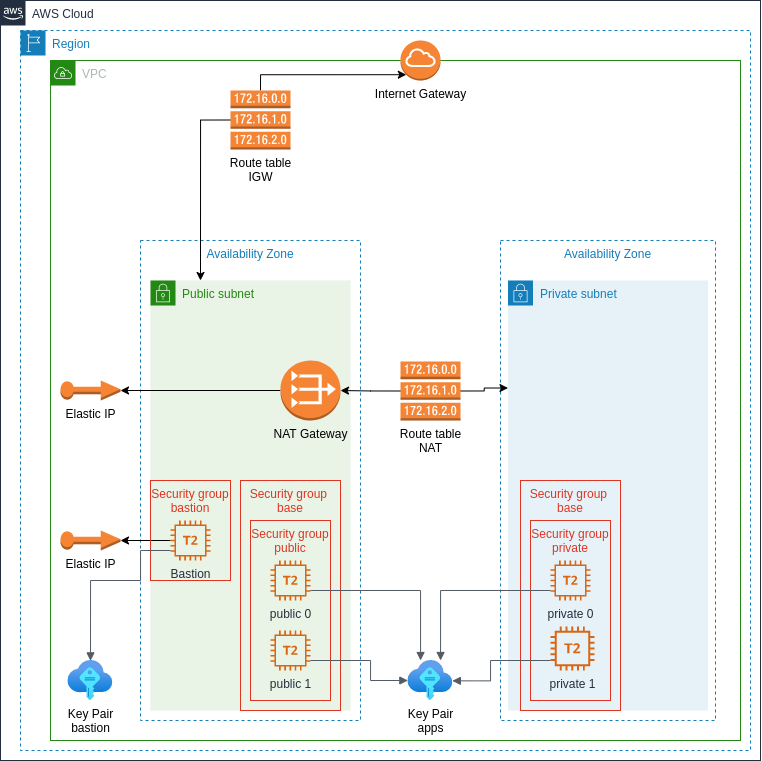

### Implementing the scenario: https://docs.aws.amazon.com/vpc/latest/userguide/VPC_Scenario2.html
### Route table config: https://docs.aws.amazon.com/vpc/latest/userguide/vpc-nat-gateway.html#nat-gateway-scenarios

Drawio(aws4 lib) diagram representation:



https://www.draw.io/?splash=0&libs=aws4
<br/><br/><br/>

- VPC provides a isolated network in the cloud
- Internet Gateway provides internet access for the VPC
- Route tables route traffic for subnets
- Public subnets for webservers accessible from the internet, instances should be accessible from the internet only on allowed ports on "public" security group(80,443,5000)
- Private subnets for databases and workers instances whithout access from the internet, only a set of ports(8000~8080) allowed on the "private" security group for access throught private network
- NAT Gateway to provide only outbound access to the private subnet
  - NAT gateways are expensive, an alternative in cases where is not critically required to fully isolate resources from the internet could be public subnets with tight SG/NACLs access rules
- Elastic IP's to set a fixed IP for strategic resources
- Implemented Bastion instance host for monitoring(public and private subnet instances are acessible throught port 22 only from bastion security group)
- Key pairs for ssh access (dummy generated with at `/keypairs/generate-keypairs.sh` script)
  
  Instructions to access bastion host and instances:

  - 1. Configure ssh keys agent forwarding, to allow access to private instances without storing private keys in bastion host

      eval `ssh-agent -s`                                                 # start agent
      ssh-add bastion_id_rsa                                              # add bastion key to agent(requires passphrase)
      ssh-add apps_id_rsa                                                 # add apps key to agent(requires passphrase)
      ssh-add -L                                                          # check added keys
      kill $SSH_AGENT_PID                                                 # (after use) closes agent

  - 2. Connect to instances with ssh

    - 2.1 `ssh -A ec2-user@<instance_public_ip / instance_public_dns>`    # [from local host] Connect to bastion

    - 2.2  `ssh ec2-user@<instance_private_ip / instance_private_dns>`    # [from bastion host] Connect to private instance with ssh with previously enabled ssh agent forwarding:

    - 2.3  `ssh -A -J ec2-user@<instance_public_ip / instance_public_dns> ec2-user@<instance_private_ip / instance_private_dns>`     # [from local host] Directly connect to private instance using jump flag

  References for bastion host:
  ```
  https://aws.amazon.com/pt/premiumsupport/knowledge-center/ec2-troubleshoot-bastion-host-connection/
  https://crishantha.medium.com/handing-bastion-hosts-on-aws-via-ssh-agent-forwarding-f1d2d4e8622a
  https://medium.com/codex/how-to-setup-bastion-server-with-aws-ec2-b1590d2ff8
  ```

